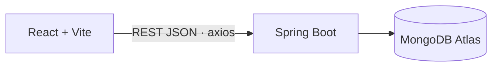
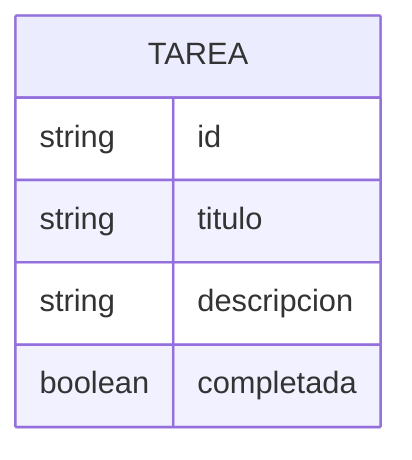

# ProyectoNube · gestor de tareas

Aplicación web de tareas con frontend y backend separados: API REST en Spring Boot con persistencia en MongoDB Atlas y una interfaz en React. Proyecto académico de arquitectura cliente-servidor en la nube.


**Frontend publicado:** https://diegofranciscog.github.io/ProyectoNube/ (necesita la API corriendo para mostrar datos).

## Problema que resuelve
Organizar tareas pendientes desde el navegador, con los datos guardados en una base de datos en la nube y no en el equipo.

## Funcionalidades
- Crear, listar, editar y eliminar tareas.
- Marcar tareas como completadas.
- Documentación de la API con OpenAPI (springdoc).

## Arquitectura


| Carpeta | Contenido |
|---|---|
| [`backend/`](backend) | API Spring Boot: controlador, servicio, repositorio y modelo `Tarea`. |
| [`frontend/`](frontend) | Interfaz React publicada en GitHub Pages. |

## Modelo de datos

Colección `tareas` en MongoDB.

## Ejecutar en local
```bash
export MONGODB_URI="mongodb+srv://..."   # PowerShell: $env:MONGODB_URI="mongodb+srv://..."
cd backend && ../mvnw spring-boot:run   # API en http://localhost:8080
cd frontend && npm ci && npm run dev  # web en http://localhost:5173
```

## Variables de entorno
| Variable | Descripción | Obligatoria |
|---|---|---|
| `MONGODB_URI` | URI de conexión de MongoDB Atlas | Sí |

## API
| Método | Ruta | Descripción |
|---|---|---|
| GET | `/api/tareas` | Lista las tareas |
| POST | `/api/tareas` | Crea una tarea |
| PUT | `/api/tareas/{id}` | Actualiza una tarea |
| DELETE | `/api/tareas/{id}` | Elimina una tarea |

## Seguridad aplicada
- La URI de MongoDB se lee de la variable `MONGODB_URI`; ninguna credencial queda en el repositorio ni en su historial.

## Roadmap
- [ ] Unificar el backend en una sola carpeta (hoy hay una copia en la raíz y otra en `backend/`).
- [ ] CORS con orígenes explícitos desde variables de entorno.
- [ ] URL de la API del frontend desde `VITE_API_URL`.
- [ ] Tests con Testcontainers (MongoDB), Dockerfile y CI con gitleaks.

## Autor
**Diego Francisco Granda Zhingre** · [GitHub](https://github.com/DiegoFranciscoG) · [LinkedIn](https://www.linkedin.com/in/diego-francisco-g-61b793254/) · [Portafolio](https://diegofranciscog.github.io/)
